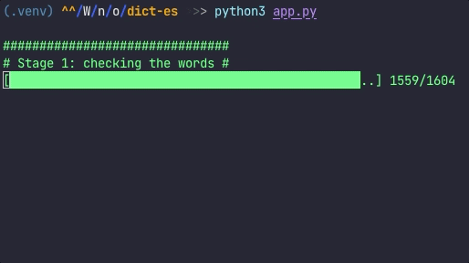

### Get Word polarity form dictionary file or list of words

This is a simple implementation of word polarity classification and is not perfect. 🙈  
I needed a list of Spanish words with their sentimental rating that I didn't find in my searches.  
I think this list exists somewhere in the Universe, but I don't want to waste too much time looking for it.😴  

### What is this?
The project can determine word sentiment (positive/negative) in languages other than English. After verification, new files are generated in groups by adjectives, verbs and adverbs.
It's not magic, just a different way of classifying the possible feeling of the word.  

### Tech
The project uses the following components:
 - [textblob](https://textblob.readthedocs.io/en/dev/)
 - [googletrans](https://pypi.org/project/googletrans/)
 - [termcolor](https://pypi.org/project/termcolor/) (Because I like colors)

### How to
 1. Create a new virtual environment: `python3 -m venv .venv`
 2. Install the dependencies: `pip3 install -r requirements.txt`
 3. Create a new dictionary file or download from the source: check the [example_file.txt](example_file.txt)
 4. Run the command: `python3 app.py`
 5. Enjoy

### Terminal preview

I used [Universal Dictionaries]() as my reference to the contents of the file. They've done a really good job.
